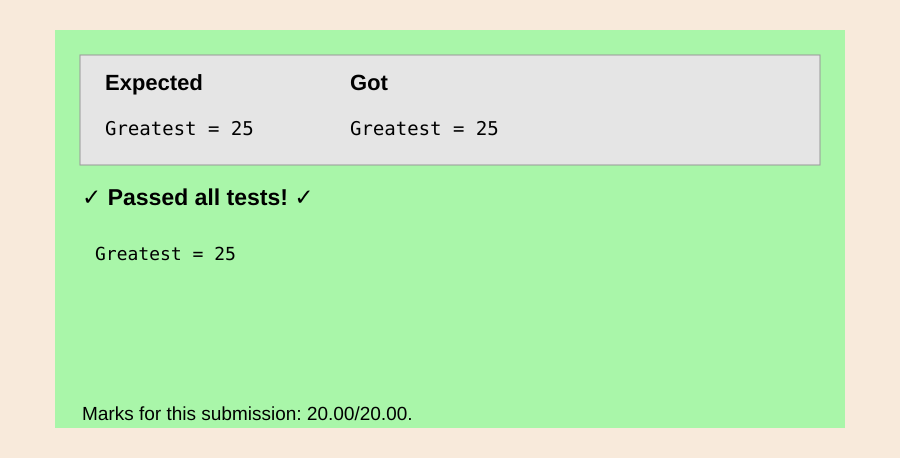
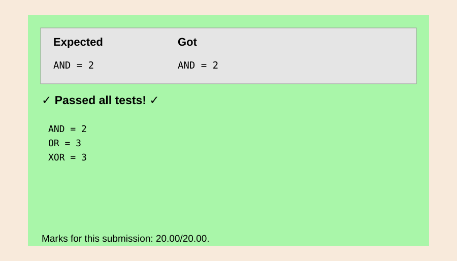
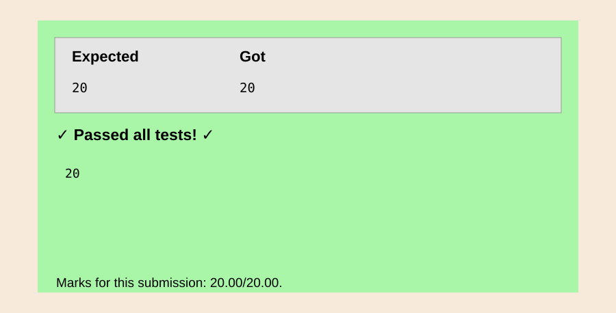
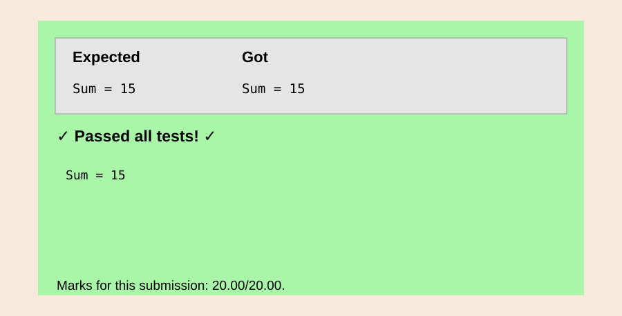
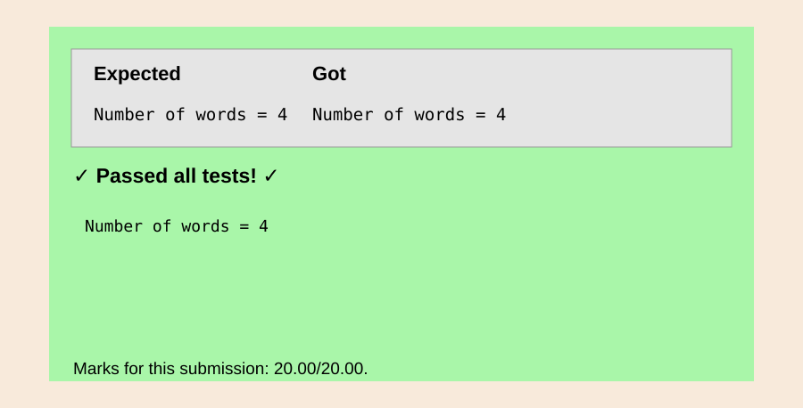

EXP NO:21 C PROGRAM TO CREATE A FUNCTION TO FIND THE GREATEST NUMBER
Aim:
To write a C program to create a function to find the greatest number

Algorithm:
1.	Include the necessary header #include <stdio.h>.
2.	Use a series of if and else if statements to compare the values and return the maximum among them.
3.	Declare variables n1, n2, n3, n4, and greater to store user input and the result.
4.	Use scanf to take four integers as input.
5.	Call the max_of_four function with the input integers and store the result in the greater variable
 
Program:
```c
#include <stdio.h>
int max_of_four(int a,int b,int c,int d){int m=a;if(b>m)m=b;if(c>m)m=c;if(d>m)m=d;return m;}int main(){int a,b,c,d;scanf("%d%d%d%d",&a,&b,&c,&d);printf("Greatest = %d",max_of_four(a,b,c,d));return 0;}
```

Output:


Result:
Thus, the program  that create a function to find the greatest number is verified successfully.


 
EXP NO:22 C PROGRAM TO PRINT THE MAXIMUM VALUES FOR THE AND, OR AND  XOR COMPARISONS
Aim:
To write a C program to print the maximum values for the AND, OR and XOR comparisons

Algorithm:
1.	Define a function calculate_the_max that takes two integers n and k as parameters.
2.	Declare variables a, o, and x to store the maximum values for AND, OR, and XOR operations, respectively.
3.	Use nested loops to iterate through pairs of integers (i, j) from 1 to n.
4.	Within the loops, check conditions for AND, OR, and XOR operations and update the corresponding maximum values (a, o, x).
5.	Declare variables n and k to store user input.
6.	Use scanf to take two integers as input.
7.	Call the calculate_the_max function with input values.
 
Program:
```c
#include <stdio.h>
void calculate_the_max(int n,int k){int a=0,o=0,x=0,i,j,v;for(i=1;i<=n;i++)for(j=i+1;j<=n;j++){v=i&j;if(v>a&&v<k)a=v;v=i|j;if(v>o&&v<k)o=v;v=i^j;if(v>x&&v<k)x=v;}printf("AND = %d\nOR = %d\nXOR = %d",a,o,x);}int main(){int n,k;scanf("%d%d",&n,&k);calculate_the_max(n,k);return 0;}
```

Output:


Result:
Thus, the program to print the maximum values for the AND, OR and XOR comparisons
is verified successfully.


 
EXP NO:23 C PROGRAM TO WRITE THE LOGIC FOR THE REQUESTS
Aim:
To write a C program to write the logic for the requests

Algorithm:
1.	Declare variables noshel and noque to store the number of shelves and the number of queries, respectively.
2.	Use scanf to take two integers as input for the number of shelves and queries.
3.	Declare a 2D array shelarr to represent shelves and books, and an array nobookarr to store the number of books on each shelf.
4.	Declare variables k and c to keep track of the book index and the total number of books.
5.	Use a for loop to iterate over the queries.
 
Program:
```c
#include <stdio.h>
int main(){int s,q,i,t,x,y,n[100]={0},a[100][100]={0};scanf("%d%d",&s,&q);for(i=0;i<q;i++){scanf("%d%d%d",&t,&x,&y);if(t==1)a[x][n[x]++]=y;else if(t==2)printf("%d\n",a[x][y]);}return 0;}
```

Output:



Result:
Thus, the program to write the logic for the requests is verified successfully.


 
EXP NO:24 C PROGRAM PRINT THE SUM OF THE INTEGERS IN THE ARRAY.
Aim:
To write a C program print the sum of the integers in the array.

Algorithm:
1.	Declare a variable n to store the number of integers.
2.	Use scanf to take an integer n as input.
3.	Declare an array a of size n to store the integers.
4.	Declare a variable sum and initialize it to zero.
5.	Use a for loop to iterate n times:
6.	Use scanf to input each integer and add it to the sum.
7.	Print the final sum using printf.


Program:
```c
#include <stdio.h>
int main(){int n,i,x,sum=0;scanf("%d",&n);for(i=0;i<n;i++){scanf("%d",&x);sum+=x;}printf("Sum = %d",sum);return 0;}
```

Output:


 


Result:
Thus, the program prints the sum of the integers in the array is verified successfully.


 
EXP NO 25: C PROGRAM TO COUNT THE NUMBER OF WORDS IN A      SENTENCE


Aim:

To write a C program that counts the number of words in a given sentence.

Algorithm:

1.	Input the sentence: Take a sentence from the user.
2.	Initialize a counter variable: This will keep track of the number of words.
3.	Process each character of the sentence:
o	Iterate through the sentence, checking each character.
o	If a character is not a space, it may belong to a word. If it's the first non-space character after a space or at the start, increment the word count.
4.	Handle spaces and punctuation: Skip over spaces, punctuation marks, and consider each word as a sequence of characters separated by spaces.
5.	Display the result: After processing the sentence, output the total word count.


Program:
```c
#include <stdio.h>
#include <ctype.h>
int main(){char s[200];int i,w=0,in=0;fgets(s,sizeof(s),stdin);for(i=0;s[i];i++){if(!isspace((unsigned char)s[i])){if(!in)w++;in=1;}else in=0;}printf("Number of words = %d",w);return 0;}
```

Output:



Result:

Thus, the program that counts the number of words in a given sentence is verified 
successfully.
