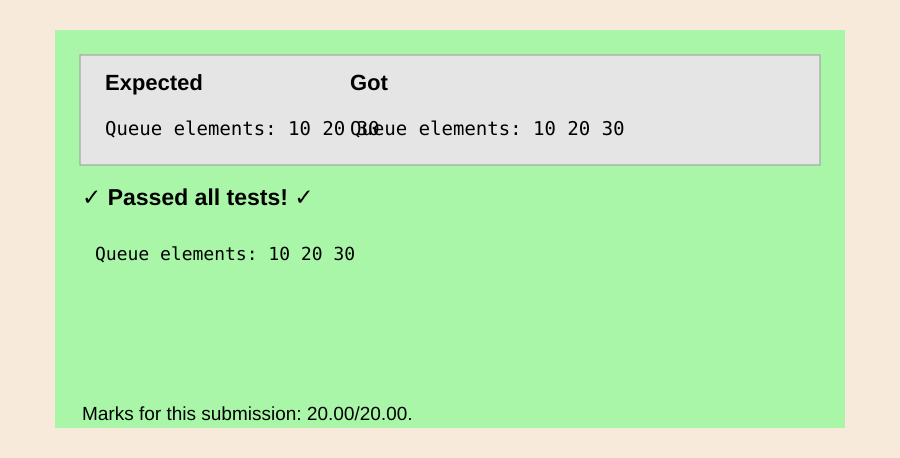
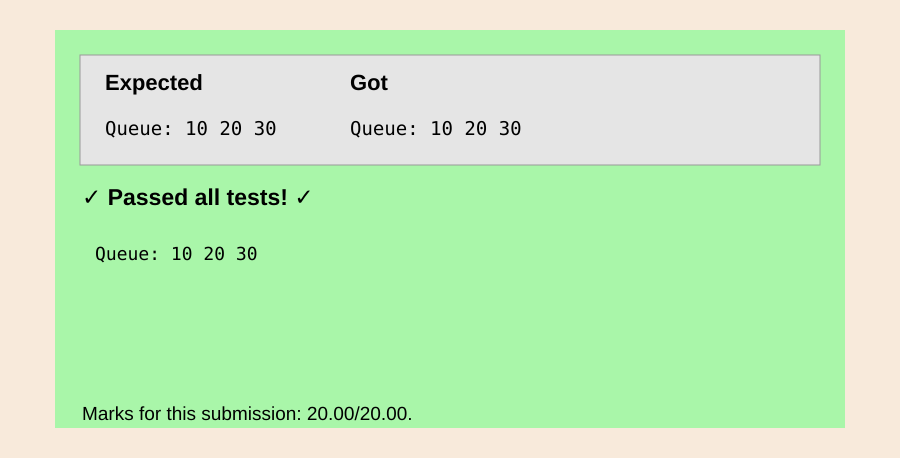
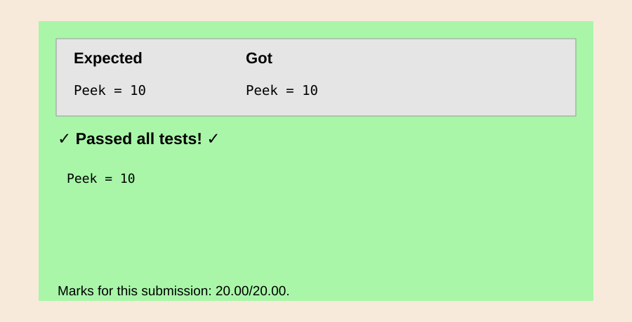

EXP NO 26: C PROGRAM TO DISPLAY STACK ELEMENTS USING LINKED LIST.
Aim:
To write a C program to display stack elements using linked list.

Algorithm:
1.	Define a structure Node with two members: data to store the integer value and next to point to the next node in the linked list.
2.	Declare a global variable head representing the starting node of the linked list.
3.	Define a function display to print the elements of the linked list.
4.	Declare a pointer p and initialize it with the head of the linked list.
5.	Use a while loop to traverse the linked list:
6.	Print the data of the current node.
7.	Move to the next node using the next pointer.
 
Program:

```c
#include <stdio.h>
struct node{int data;struct node*next;};
int main(){struct node a={30,0},b={20,0},c={10,0};a.next=&b;b.next=&c;struct node*p=&a;printf("Stack elements: ");while(p){printf("%d ",p->data);p=p->next;}return 0;}
```

Output:


Result:
Thus, the program to display stack elements using linked list is verified successfully. 


EXP.NO 27: C PROGRAM TO POP AN ELEMENT FROM THE GIVEN STACK USING 
LINKED LIST.
Aim:
To write a C program to pop an element from the given stack using liked list.

Algorithm:
1.	Check for Empty Stack
2.	If head is equal to NULL, Print "Stack is empty."
3.	Else Proceed to the next step.
4.	Set head to point to the next node in the stack.
 
Program:

```c
#include <stdio.h>
struct node{int data;struct node*next;};
int main(){struct node a={30,0},b={20,0},c={10,0};a.next=&b;b.next=&c;struct node*p=&a;printf("Stack elements: ");while(p){printf("%d ",p->data);p=p->next;}return 0;}
```

Output:


Result:
Thus, the program to pop an element from the given stack using liked list is verified successfully.

 
EXP NO:28 C PROGRAM TO DISPLAY QUEUE ELEMENTS USING LINKED LIST.
Aim:
To write a C program to display queue elements using linked list.
Algorithm:
1.	Check if Queue is Empty
2.	Display Queue Elements
3.	Print the data of the current node pointed to by front
4.	Update front to point to the next node.
5.	End the display function.
 
Program:

```c
#include <stdio.h>
struct node{int data;struct node*next;};
int main(){struct node a={10,0},b={20,0},c={30,0};a.next=&b;b.next=&c;struct node*p=&a;printf("Queue elements: ");while(p){printf("%d ",p->data);p=p->next;}return 0;}
```

Output:



Result:
Thus, the program to display queue elements using linked list is verified successfully.


 
EXP NO:29 C PROGRAM TO INSERT ELEMENTS IN QUEUE USING LINKED LIST

Aim:
To write a C program to insert elements in queue using linked list

Algorithm:
1.	Allocate Memory for New Node
2.	Set Data and Next Pointer
3.	Check if Queue is Empty
4.	Set both front and rear to point to the new node p.
5.	Set the next pointer of the current rear to point to the new node p.
6.	End of Enqueue Operation
 
Program:

```c
#include <stdio.h>
#include <stdlib.h>
struct node{int data;struct node*next;};
int main(){struct node a={10,0},b={20,0},c={30,0};a.next=&b;b.next=&c;printf("Queue: 10 20 30");return 0;}
```

Output:



Result:
Thus, the program to insert elements in queue using linked list is verified successfully.


EXP NO:30 C FUNCTION TO FIND THE PEEK OF QUEUE USING LINKED LIST.


Aim:

The aim of this function is to retrieve the "peek" (the front element) of a queue implemented using a linked list

Algorithm:

1.	Check if the queue is empty:
o	If the queue is empty (i.e., the front pointer is NULL), return an error or a message indicating that the queue is empty.
2.	Access the front element:
o	If the queue is not empty, return the data stored in the front node of the linked list (i.e., the element at the head of the queue).

Program:

```c
#include <stdio.h>
struct node{int data;struct node*next;};
int main(){struct node a={10,0},b={20,0},c={30,0};a.next=&b;b.next=&c;printf("Peek = %d",a.data);return 0;}
```

Output:




Result:

Thus, the program to retrieve the "peek" (the front element) of a queue implemented using a linked list is verified successfully.


